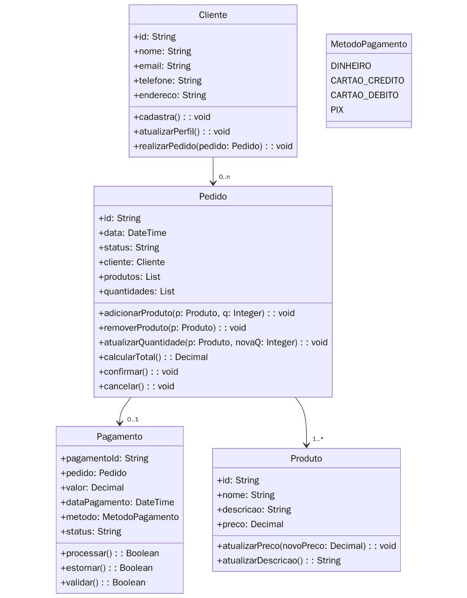

# 💳 Sistema de Pagamento

Este é um sistema de pagamento simples construído em **Node.js com TypeScript** para a disciplina de Programação Orientada a Objetos, utilizando **Prisma ORM**, **PostgreSQL** e **Docker**. A aplicação fornece rotas para simular pagamentos e gerenciar transações.

---

## - Modelagem inicial do sistema de pagamento



## 📁 Estrutura do Projeto

- `src/`: Código-fonte da aplicação
    ├── models/         # Classes de domínio (Cliente, Pedido, Pagamento, etc.)
    ├── services/       # Lógica de negócio como relatórios
    ├── utils/          # Tratamento de erros, logs
    ├── __tests__/      # Testes com Vitest
    └── mock/           # Simulação de requisições e dados mockados
- `prisma/`: Migrations e schema do banco
- `docker-compose.yml`: Configuração do banco via Docker
- `.env`: Variáveis de ambiente
- `package.json`: Dependências e scripts

---

## ✅ Requisitos

Antes de começar, verifique se você tem instalado:

- [Node.js](https://nodejs.org/)
- [Docker e Docker Compose](https://www.docker.com/)
- [Git](https://git-scm.com/)

---

## 🚀 Passo a Passo para rodar o projeto

### 1. Clone o repositório

```bash
git clone https://github.com/letfirmo/SistemaDePagamento.git
cd SistemaDePagamento
