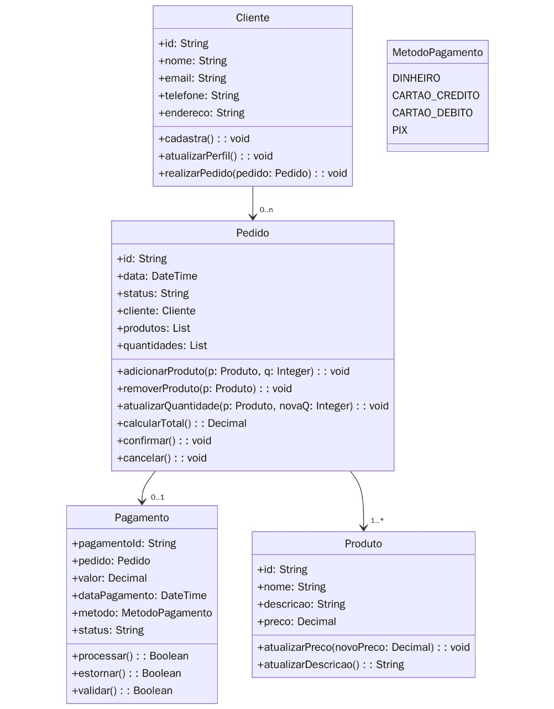

# 💳 Projeto Sistema de Pagamento
Projeto da disciplina Programação Orientada a Objetos que tem como objetivo implementar um sistema real usando os princípios de POO em linguagem moderna.

## - Modelagem inicial do sistema de pagamento

